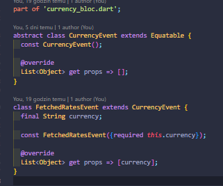

# currency_app

currency_app is a mobile application that displays the latest exchange rates of the selected currency to PLN. There are two available currency to choose from: USD and EUR. The rates are the average rates of the last 30 days. The rates are provided from [NBP_API](http://api.nbp.pl/). 

The application was developed in Flutter framework and Bloc package. The application is also based on Clean Architeture.

## Technologies, packages and APIs

* [Flutter](https://flutter.dev/)
* [Bloc](https://pub.dev/packages/flutter_bloc)
* [syncfusion_flutter_charts](https://pub.dev/packages/syncfusion_flutter_charts)
* [NBP_API](http://api.nbp.pl/)

## Overview

First of all, let's take a look at project tree:

As I mentioned, the application is based on the Clean Architeture scheme, so it is divided into, first, features. Here we have only one, which is "currency". In addition, "currency" is divided into 3 folders "data", "domain" and "presentation", which describe the different layers of the application. "Data" has 3 internal folders: "datasource" with the file "currency_rate_data_source.dart", whose task is to retrieve data from the API, and "models" and "repositories", which implement or extend classes from the layer and folder "domain", accordingly, "entities" and "repositories". Contents of the file "currency_rate_data_source.dart":

 

"curency_rate_data_source.dart" returns data retrieved from the API. The goal is to get exchange rate data for the last 30 days, so variables with dates are created. A request to the API endpoint is then set. The returned data is decoded using the "jsonDecoded" function.

The next step is to create a list of custom objects based on the datasource data. This is in the file "currency_rate_repo_impl.dart" from data/repositories.

The "getRates" method takes data from a data source, creates a list of CurrencyRate objects (an entity from the "domain" folder) and returns it. In order to create a CurrencyRate object, a DTO is created in the "models" folder. CurrencyRateDTO extends the CurrencyRate class. CurrencyRateDTO and CurrencyRate:

Following this, we need a method that calls "getRates" from the repository. This is done in the "usecase" folder in the "domain".

The use case method is called in the bloc when the user selects a currency. To make the bloc functional we need to define states, events and logic for each event. 

Let's look at states first:

5 states are defined: CurrencyState (as parent, abstract class), CurrencyInitial (default state of app), FetchedRatesState (with list of CurrencyRate objects as field), ErrorState (in case of some kind of error during exection with String type field named error) and LoadingState (is set when we waiting for data from API)

We have 2 class as events. CurrencyEvent as abstract class and FetchedRatesEvent with String type field.

All states and events are used in bloc login as below:

When FetchedRatesEvent is requested, the application calls a method from usecase that returns a CurrencyRate list, with the currency from the event as a parameter, as described above. Before that, we change the application's state to LoadingState (to display the loading widget in the UI). After returning the list, we change the state to FetchedRatesState. In case of errors, all this code is in try-catch. If an error occurs, it is caught and the state is changed to ErrorState.

An example of an event request in the UI:

## UI 

Example of screens from application:

* Initial screen app:
  

* Choosing currency:
  

* Rates of currency as table:
  

* Rates of currency as line chart (scrollable horizotally):

* Rates of currency as bar chart (scrollable vertically):

